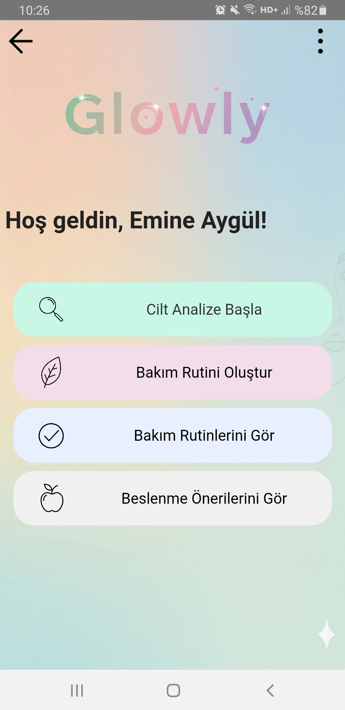
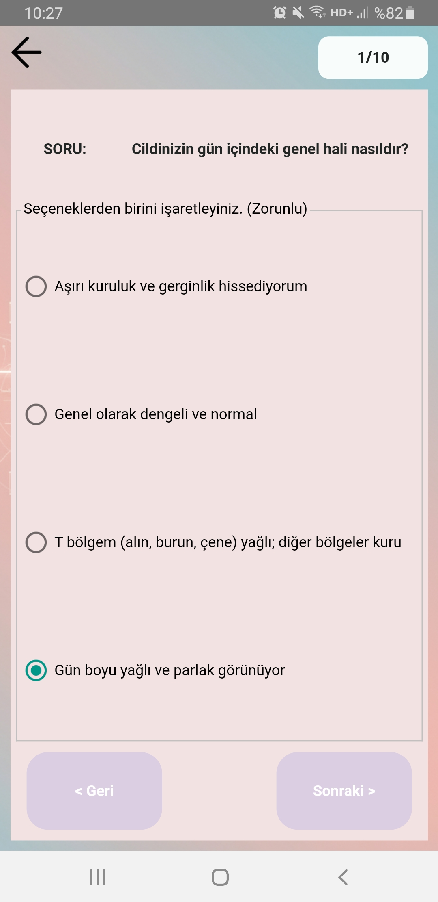
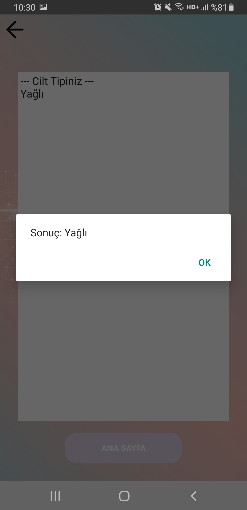
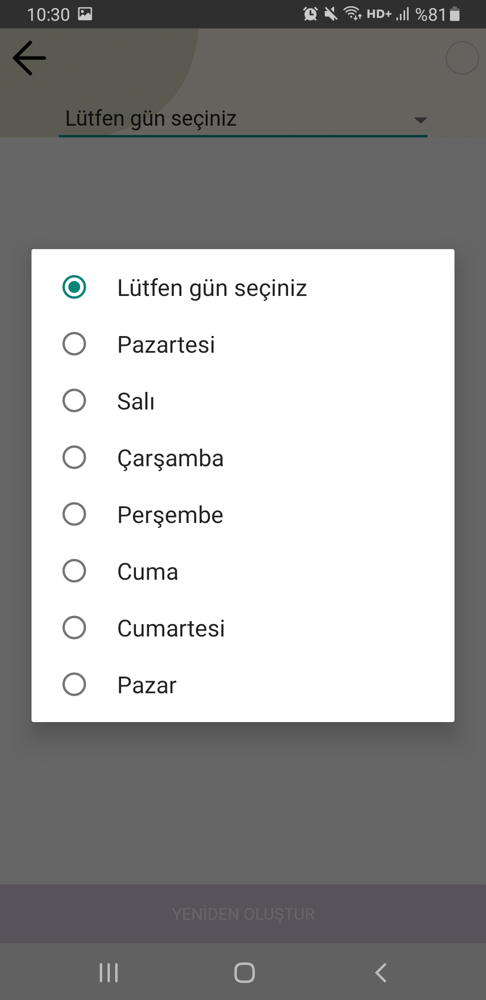
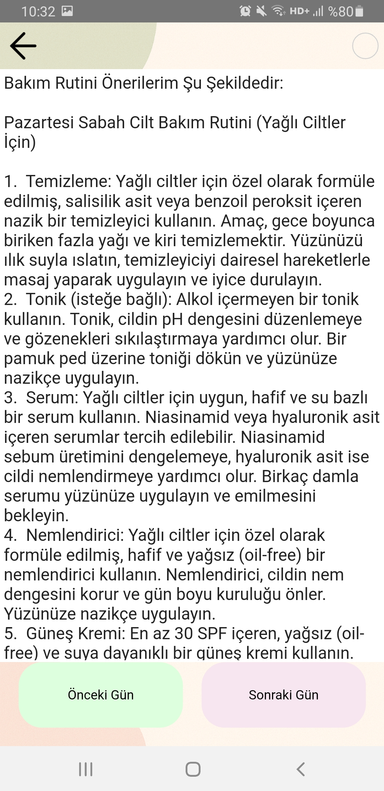
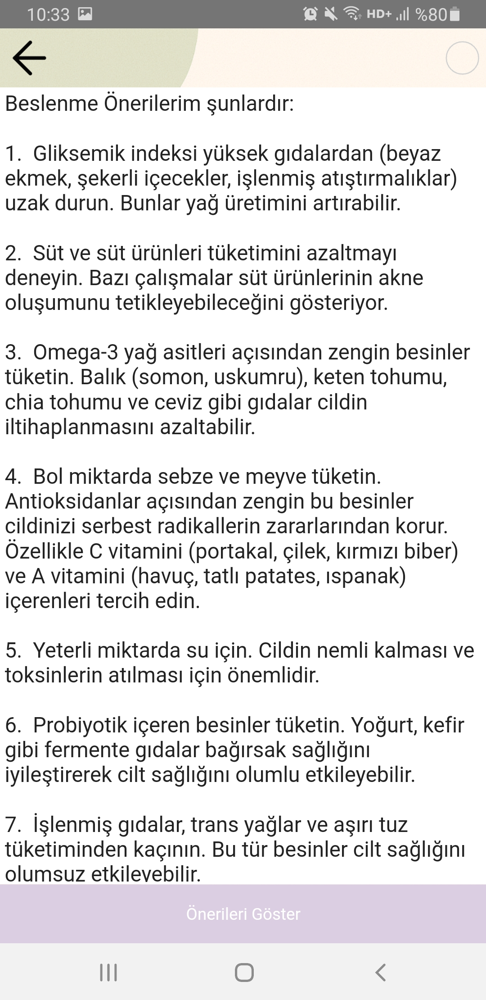
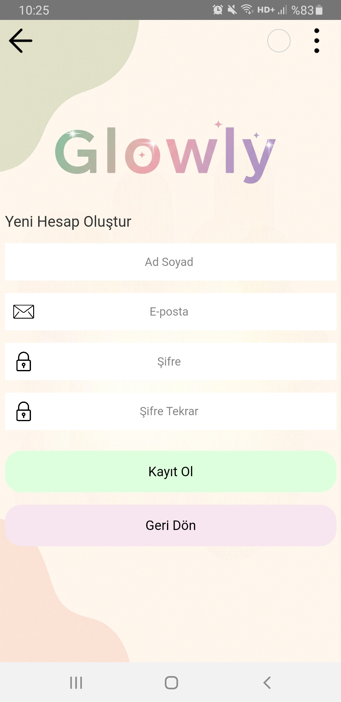
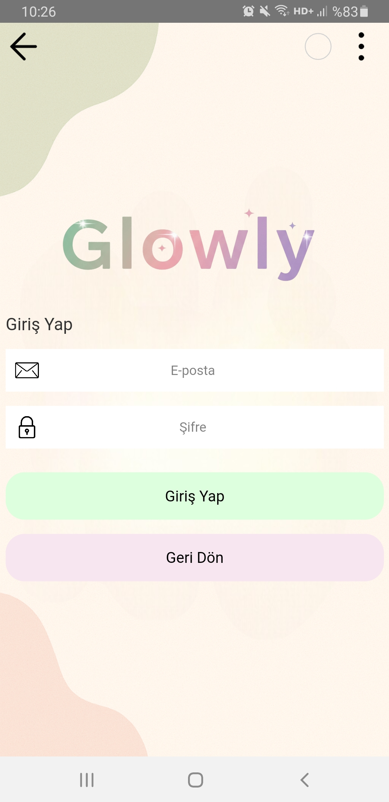

# glowly-software-internship-project

# 🌿 Glowly – AI Powered Skin Analysis & Skincare Assistant

*🇹🇷 [Türkçe versiyonu için aşağı kaydırabilirsiniz.](#-glowly--yapay-zeka-destekli-cilt-analizi--bakım-asistanı)*

Glowly is a mobile application that analyzes the user's skin type through a set of questions and provides personalized skincare routines and nutrition recommendations using Artificial Intelligence.

The goal of the project is to help users better understand their skin and build healthier skincare habits with personalized suggestions.

---

## ✨ Features

* **🔍 AI-Based Skin Analysis:** Users answer a set of questions and the system determines their skin type.
* **🧴 Personalized Skincare Routines:** Daily skincare routines are created according to the user's skin type.
* **🥗 Nutrition Recommendations:** Glowly generates nutrition suggestions that may help improve skin health.
* **📅 Daily Routine Tracking:** Users can view skincare routines for each day of the week.
* **⚠️ Smart Warning System:** If a routine is not created for a specific day, the system shows a warning message.
* **📊 Skin Analysis Results:** Users can view the results of their skin analysis in a dedicated results screen.

## ⚙️ How It Works?

1. The user signs up or logs into the application.
2. The system asks skin analysis questions.
3. Answers are processed to determine the user’s skin type.
4. Based on the result, the application generates:
   * Personalized skincare routines
   * Nutrition recommendations
5. Users can view and manage their routines for different days.

## 🛠 Technologies Used

* **TRObject** – Application development
* **SQLite** – Local database management
* **AI Integration** – For generating skincare and nutrition recommendations
* **REST API** – Communication with AI services
* **Clomosy Platform** – Development environment

## 📱 Screens

The application includes several screens such as:

## 📱 Screens

The application includes several screens such as:

**Home Screen**  
   

**Skin Analysis Question Screen**  
   

**Skin Analysis Result Screen**  
   

**Skincare Routine Creation Screen**  
   

**Skincare Routine Display Screen**  
   

**Nutrition Recommendation Screen**  
   

**Sign Up Screen**  
   

**Login Screen**  

## 💡 Project Purpose

Glowly aims to make skincare more personalized, accessible, and intelligent by combining mobile development and artificial intelligence.

Instead of generic advice, users receive recommendations tailored to their own skin type.

## 🚀 Future Improvements

* Camera-based skin analysis
* More advanced AI recommendations
* Skin progress tracking
* Community features for sharing experiences

## 👩‍💻 Developer

**Emetullah Emine Aygül**
*Developed as part of a computer engineering and mobile application development internship project.*

---
---

# 🌿 Glowly – Yapay Zeka Destekli Cilt Analizi & Bakım Asistanı

Glowly, kullanıcılara çeşitli sorular yönelterek cilt tiplerini analiz eden ve Yapay Zeka kullanarak kişiselleştirilmiş cilt bakım rutinleri ile beslenme önerileri sunan bir mobil uygulamadır.

Projenin amacı, kişiselleştirilmiş önerilerle kullanıcıların ciltlerini daha iyi anlamalarına ve daha sağlıklı cilt bakım alışkanlıkları edinmelerine yardımcı olmaktır.

---

## ✨ Özellikler

* **🔍 Yapay Zeka Tabanlı Analiz:** Kullanıcılar çeşitli soruları yanıtlar ve sistem cilt tipini belirler.
* **🧴 Kişiselleştirilmiş Bakım Rutinleri:** Kullanıcının cilt tipine göre günlük bakım rutinleri oluşturulur.
* **🥗 Beslenme Önerileri:** Glowly, cilt sağlığını iyileştirmeye yardımcı olabilecek beslenme tavsiyeleri sunar.
* **📅 Günlük Rutin Takibi:** Kullanıcılar haftanın her günü için cilt bakım rutinlerini görüntüleyebilir.
* **⚠️ Akıllı Uyarı Sistemi:** Belirli bir gün için rutin oluşturulmamışsa sistem uyarı mesajı gösterir.
* **📊 Cilt Analizi Sonuçları:** Kullanıcılar cilt analizi sonuçlarını özel bir sonuç ekranında görüntüleyebilir.

## ⚙️ Nasıl Çalışır?

1. Kullanıcı uygulamaya kayıt olur veya giriş yapar.
2. Sistem cilt analizi sorularını sorar.
3. Verilen cevaplar işlenerek kullanıcının cilt tipi belirlenir.
4. Sonuca bağlı olarak uygulama şunları üretir:
   * Kişiselleştirilmiş cilt bakım rutinleri
   * Beslenme önerileri
5. Kullanıcılar farklı günler için rutinlerini görüntüleyebilir ve yönetebilir.

## 🛠 Kullanılan Teknolojiler

* **TRObject** – Uygulama geliştirme
* **SQLite** – Yerel veritabanı yönetimi
* **Yapay Zeka Entegrasyonu** – Cilt bakımı ve beslenme önerileri üretmek için
* **REST API** – Yapay zeka servisleriyle iletişim
* **Clomosy Platformu** – Geliştirme ortamı

## 📱 Ekran Görüntüleri

Uygulamada yer alan bazı ekranlar şunlardır:

**Ana Ekran**  
   

**Cilt Analizi Soru Ekranı**  
   

**Cilt Analizi Sonuç Ekranı**  
   

**Cilt Bakım Rutini Oluşturma Ekranı**  
   

**Cilt Bakım Rutini Görüntüleme Ekranı**  
   

**Beslenme Önerisi Ekranı**  
   

**Kayıt Ol Ekranı**  
   

**Giriş Yap Ekranı**  

## 💡 Projenin Amacı

Glowly, mobil geliştirme ve yapay zekayı harmanlayarak cilt bakımını daha kişiselleştirilmiş, erişilebilir ve akıllı hale getirmeyi amaçlamaktadır. 

Kullanıcılar jenerik ve sıradan tavsiyeler yerine, doğrudan kendi cilt tiplerine uygun öneriler alırlar.

## 🚀 Gelecek Geliştirmeler

* Kamera tabanlı cilt analizi
* Daha gelişmiş yapay zeka önerileri
* Cilt gelişim takibi
* Deneyim paylaşımı için topluluk özellikleri (Community)

## 👩‍💻 Geliştirici

**Emetullah Emine Aygül**
*Bilgisayar mühendisliği ve mobil uygulama geliştirme staj projesi kapsamında geliştirilmiştir.*